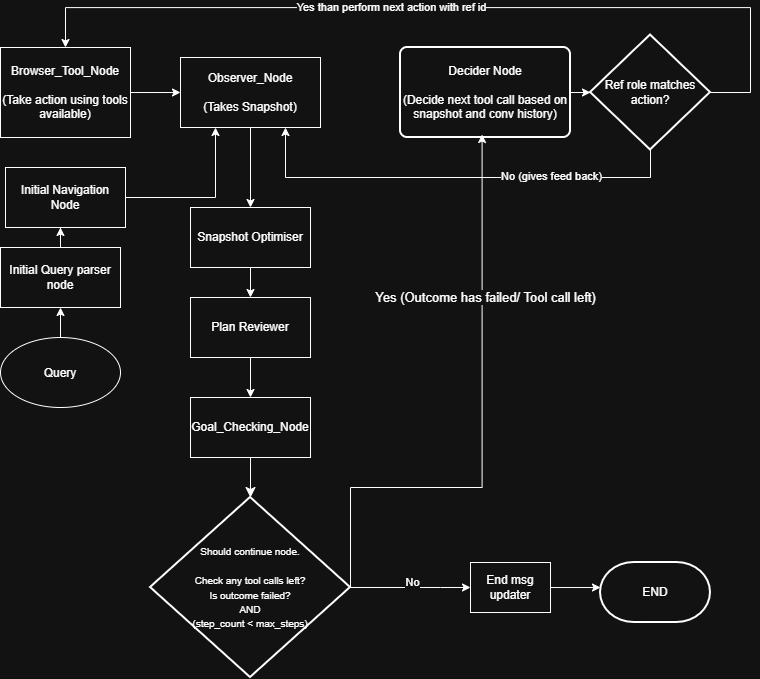

## Browser Automation Agent

A LangGraph agent that runs a perceive → act → verify loop on live websites.
It reads the page's accessibility tree instead of raw HTML, decides on one
tool call at a time, validates that call against the real page before
executing it, and loops back to re-observe after every action.

### Status: 🟡 Partially working, actively debugging

Works end to end on some real sites and goals. Still fails in other cases —
this is an active work in progress, not a finished system. See Known
Limitations below for the honest list of what's shaky.

---

### Architecture

Each loop iteration: observe the page → optimize/chunk the snapshot → review
the plan → check if the goal is met → if not, decide one tool call → validate
the ref that call targets is real and matches the expected role → execute it
→ re-observe.

### How it works today

**Perception:** `observer_node` captures the page via Playwright's
`aria_snapshot(mode="ai")`, giving structured role/name/ref data instead of
raw HTML. `snapshot_optimizer_node` chunks large snapshots since full pages
can exceed what fits in a single decision call.

**Decision:** `decider_node` proposes exactly one tool call per turn based on
the current (possibly partial) snapshot, the goal, and any error feedback
from the previous attempt. Uses a small local model (Qwen2.5 3B via Ollama).

**Validation:** `ref_validator_node` checks that a proposed ref actually
exists in the most recent snapshot and that its role matches what the tool
expects (e.g. a click target must be a button/link-type role, not a
searchbox). Invalid refs are rejected with a specific error and routed back
to `observer_node` for recovery, rather than crashing the run.

**Execution:** valid actions run through a standard LangGraph `ToolNode`
against the real browser tools (click, type, navigate, scroll, go back,
extract content), then the loop re-observes the resulting page state.

**Completion:** `goal_check_node` decides whether the goal is met, capped by
`max_steps` (default 12) as a hard stop regardless of outcome.

### Known Limitations

- **Inconsistent reliability across sites/goals** — works on some real tasks,
  fails on others; not yet robust enough to trust unattended
- **`human_feedback_node` exists but isn't wired into the graph** — no edges
  currently route to or from it, so human-in-the-loop recovery isn't active
  yet despite the node being defined
- **`plan_reviewer_node`'s role is still unsettled** — sits in the main loop
  but its actual contribution to decision quality hasn't been confirmed;
  may be a placeholder pending a real implementation decision
- **Goal-completion detection has a known gap** — `should_continue`'s
  goal-check output isn't fully reaching `final_answer` in all cases yet
- **Small local model (3B params) driving tool selection** — prone to
  occasional malformed or mismatched tool calls under complex snapshots;
  ref validation catches many of these, but not a substitute for a more
  capable model
- **Sub-goal persistence across multi-hop action chains** not yet implemented
- **Not wired into the planned Orchestrator** — currently a standalone agent,
  invoked directly (including from the Voice STT pipeline, see
  `voice/README.md`)

### Stack
LangGraph, Playwright, Python, structured output (Pydantic), Ollama (Qwen2.5 3B)